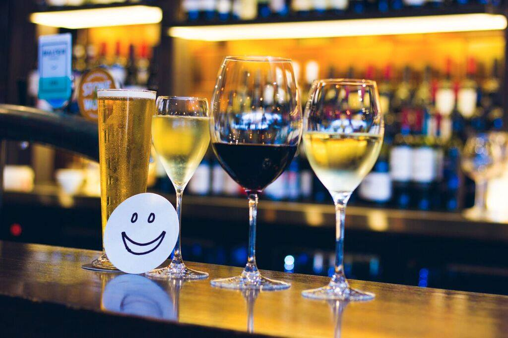

```{r setup, include=FALSE}
knitr::opts_chunk$set(echo = TRUE)
library(tidyverse)
library(lubridate)
library(googlesheets)

# Get venue data
social.data <- gs_title("ysc2017") %>% 
  gs_read("social")

```

# Social events

```{r, echo = FALSE}
knitr::kable(social.data,
             col.names  = c("Event", "Venue", "Time", "Date", "Description", "Cost"))
```

# Conference dinner

```{r echo = FALSE, fig.align='center', out.width="30%"}

```


The YSC2017 dinner will be held on 26 September 2017 at 6:30pm at [Bin72](http://bin72.com.au/) on the Coolangatta waterfront. Join the delegates and keynote speakers of YSC2017 for a memorable night out with fellow young statisticians.
 
Bin72 is a popular bar and dining venue located on the first floor of “The Strand”, a small shopping centre on Marine Parade in Coolangatta,  just a few minutes on foot from the Mantra Twin Towns resort. The cuisine is Asian fusion tapas and dinner will be shared plates. If you are registered for YSC2017, the dinner is included in your conference fee – you do not need to purchase a ticket.
 
Should you need additional dinner tickets you have the option of purchasing them for \$40 [here](http://www.statsoc.org.au/events/ssai-events/ysc2017-conference-dinner-bin72/). The fee of \$40 includes the meal and a drink.
 
Please pick up your dinner and drink voucher at the YSC2017 registration desk prior to the event.
 
**Important**: You do not need to buy a dinner ticket for yourself if you are registered for YSC2017 since dinner is included in your conference fee!

```{r echo = FALSE, fig.align="center"}
knitr::include_graphics("pics/Bin72.jpg")

```

